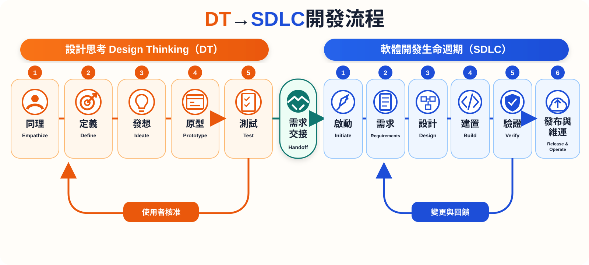

# DT–SDLC Codex Skills

一組將 Design Thinking（DT）需求探索銜接至 Software Development Life Cycle（SDLC）交付流程的 Codex Skills，協助使用者從問題定義、方案驗證、需求與架構設計，一路進行實作、測試、部署規劃及最終驗收。

## 專案資訊

- 作者：National Tsing Hua University, Professor Chih-Hung Wu
- 目前版本：1.1.0
- 發布狀態：準備發布至 GitHub
- Skills：`dt`、`sdlc`、`dt-sdlc`

版本採語意化版本：Patch 是相容修補；Minor 是向下相容的新功能；Major 是不相容變更。

## DT–SDLC 開發流程



流程先以 Design Thinking 理解使用者並驗證問題與方案，通過需求交接後再進入 SDLC 的需求、設計、建置、驗證、發布與維運。測試與驗證結果可回到前一階段修正，重要關卡需由使用者明確核准。

## 本 Skill 採用的 DT 流程

1. **Empathize**：確認使用者、情境、痛點、證據、輸入與限制。
2. **Define**：形成問題陳述、處理與輸出需求、MVP、非目標、成功指標及 AI 權限邊界。
3. **Ideate**：比較方案的需求價值、可行性、商業性與風險。
4. **Prototype**：以最低成本的原型驗證最高風險假設。
5. **Test**：定義參與者、任務、觀察指標與繼續、修改或停止的判斷規則。

訪談採自適應深度：先從已知資訊推斷，只詢問會影響範圍、體驗、架構、安全或驗收的缺口。簡單低風險需求只確認摘要；需求模糊或風險提高時，每次增加一至三個關鍵問題。

需要使用者決策時，`dt-sdlc` 優先提供完整的數字選項並標示建議，讓使用者直接用數字回答；若沒有合適選項，可選擇 `0. 其他` 並輸入文字。只有無法合理列舉選項的答案才直接使用文字提問。

## 本 Skill 採用的 SDLC 流程

1. **Initiate**：建立目標、範圍、利害關係人、限制、風險與交付情境。
2. **Requirements**：定義功能、非功能、輸入、處理、輸出、資料契約、錯誤行為及驗收標準。
3. **Design**：選擇架構、介面、技術、視覺方向、安全邊界、部署目標與維運模型。
4. **Plan and Build**：拆分可驗證增量，先完成最小端到端功能。
5. **Verify**：依風險進行單元、整合、系統、回歸、效能、安全與使用者驗收測試。
6. **Release and Operate**：準備安裝、Secret 設定、資料遷移、回滾、監控、事件處理及維護。

`dt-sdlc` 負責保存決策、控制階段關卡、需求變更與追溯性，並要求使用者明確核准 DT 交接、設計、發布與最終驗收。

## 安裝

在 Windows PowerShell 進入專案根目錄後執行：

```powershell
.\INSTALL_SKILLS.ps1
```

或將 `installable-skills` 下的 `dt`、`sdlc`、`dt-sdlc` 三個資料夾完整複製到 `$CODEX_HOME/skills`。若未設定 `CODEX_HOME`，Windows 通常使用 `%USERPROFILE%\.codex\skills`。完成後重新啟動 Codex 或開啟新的工作階段。

## 部署至 GitHub

本專案可以部署到 GitHub。首次發布前需先決定儲存庫名稱、公開或私人可見性，以及授權方式。

1. 在 GitHub 建立空白儲存庫。
2. 在本目錄初始化 Git，提交經檢查的檔案。
3. 設定 GitHub 遠端並推送預設分支。
4. 建立版本標籤，例如 `v1.1.0`，並撰寫 Release Notes。
5. 後續修改經測試後提交並推送，GitHub 才會取得更新。

本機檔案不會在編輯後自動出現在 GitHub。建議保留明確的 commit／push 流程，以避免未完成內容、憑證或個資被意外公開。自動發布應由可信任的 CI 產生發布成品，並搭配受保護分支、審查與 Secret Manager。

### GitHub 發布範圍

本專案使用 `.gitignore` 白名單，只發布下列 Skill 相關內容：

- `installable-skills/`
- `INSTALL_SKILLS.ps1`
- `README.md`
- `THIRD_PARTY_NOTICES.md`
- `.gitignore`
- `assets/images/dt-sdlc-development-flow.svg`

本機的 `docs/`、`assets/`、`slides/`、`tools/`、`node_modules/`、`package.json` 及其他教學或開發檔案不會加入 GitHub。

## 介面品質 Skill

有 UI／UX 需求時，`sdlc` 才會檢查已安裝的介面 Skill，而不是對所有專案固定載入：

- `ui-ux-pro-max`：適合產生產品導向的設計系統、色彩、字體、圖表及技術棧建議。上游為 `nextlevelbuilder/ui-ux-pro-max-skill`，應由官方來源獨立安裝並保留 MIT 授權。
- OpenAI curated `frontend-skill`：適合高品質前端實作、視覺層級、版面、內容、影像及動態品質控制。

若缺少適合的能力，系統會先提供二至三個候選 Skill，列出來源、用途、授權、版本、必要依賴、風險及不安裝時的替代方案，並推薦其中一個。只有取得使用者對明確名稱與來源的同意後才安裝。

外部 Skill 不會複製進本專案，也不會靜默安裝或更新。正式產品應固定經過審查的版本；重大更新需重新審核，以免第三方指令、腳本、權限或網路行為在未確認下改變。

## 公開前安全檢查

- 不提交 API Key、Token、密碼、私鑰、`.env` 或含個資的測試資料。
- 不提交 `node_modules`、暫存檔、建置快取與本機設定。
- 前端不得包含長期有效的 API Key；應透過後端或 serverless function 使用受保護的 Secret。
- 對第三方程式碼、圖片、字型、模板與文件保留原授權及來源聲明。
- 不將 OpenAI、Stanford、Design Council、ISO 或其他第三方名稱描述為本專案的背書。
- 公開前檢查 Git 歷史；從最新版刪除 Secret 不代表已從歷史移除。

## 著作權與第三方資料

Copyright © 2026 National Tsing Hua University, Professor Chih-Hung Wu. All rights reserved.

目前尚未指定開放原始碼授權。公開 GitHub 儲存庫只代表內容可被瀏覽，不表示授權他人複製、修改或散布。若希望其他人能安裝、修改及再散布，應在首次公開發布前選擇 MIT、Apache-2.0 或其他適合的授權。

本專案以自行撰寫的流程與模板整理公開方法論，並在 `docs/REFERENCES.md` 與 `THIRD_PARTY_NOTICES.md` 標示來源。第三方名稱、商標、文件及標準仍屬各權利人所有；引用不代表合作、認證或背書。

## 重要目錄

```text
installable-skills/   可安裝的三個 Skills
docs/                 系統說明、開發流程、教學與參考資料
assets/               專案層級模板
slides/               教學簡報成品
tools/                簡報建置工具
```

## 免責聲明

本專案提供流程與技術規劃參考，不構成法律、資安稽核或合規認證。高風險、受監管或正式上線的產品仍應由合格人員進行法律、隱私與安全審查。
